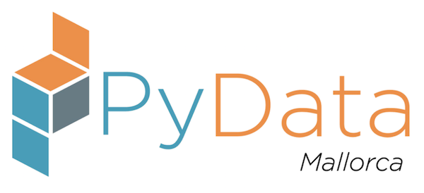

# PyConES2019: Aprendiendo cómo aprenden las máquinas

Taller "Aprendiendo cómo aprenden las máquinas" preparado por los organizadores de [PyData Mallorca](https://twitter.com/PyDataMallorca) para la [PyConES2019](https://2019.es.pycon.org/).

# Preparación imprescindible antes del taller

**NO VAMOS A DEDICAR TIEMPO A LA INSTALACIÓN DURANTE EL TALLER, ASÍ QUE POR FAVOR: VEN CON TODO INSTALADO PREVIAMENTE.**

Necesitarás lo siguiente:

* Un portátil.
* Descargar los materiales para el curso y descomprimirlos en el portátil ([usa este enlace para descargarlos](https://github.com/PyDataMallorca/PyConES2019_Aprendiendo_como_aprenden_las_maquinas/archive/master.zip)).
* Python 3.6 o superior instalado.
* Las librerías que vamos a usar (Jupyter, Numpy, Matplotlib, Pandas y Scikit-Learn).

Formas de conseguir lo anterior:

**Instalación de Anaconda**

La forma más sencilla sería instalando Anaconda para vuestro sistema operativo. La distribución Anaconda junto con instrucciones de cómo instalarlo lo podéis encontrar [en este enlace](https://www.anaconda.com/download/) (seleccionad la versión que incluya Python 3.6 o superior). La distribución Anaconda os instalará Python y un montón de paquetes que se usan en muchos ámbitos de Data Science y de la ciencia e ingeniería en general. Os dejamos también vídeos que hemos preparado para facilitaros el proceso:

* Para instalar Anaconda en Linux: https://www.youtube.com/watch?v=b9LV1J7vPuw&t=192s
* Para instalar Anaconda en MacOS: seguid las instrucciones de Linux de la línea anterior.
* Para instalar Anaconda en Windows: https://www.youtube.com/watch?v=MSnNTODnSBg

**Instalación de Miniconda**

Una segunda forma sería instalando Miniconda. Lo podéis descargar [desde este enlace](https://conda.io/miniconda.html) (seleccionad la versión que incluya Python 3.6 o superior). Una vez instalado MiniConda tenéis Python y una serie de utilidades instaladas. Os dejamos también vídeos que hemos preparado para facilitaros el proceso:

* Para instalar Miniconda en linux: https://www.youtube.com/watch?v=liqnwft_cbs
* Para instalar Miniconda en MacOS: Seguid las instrucciones de Linux de la línea anterior.
* Para instalar Miniconda en windows: https://www.youtube.com/watch?v=aYhlDfGhwuU

**Instalación de paquetes específicos**

Para instalar el resto de paquetes necesarios podéis abrir una terminal (Linux/Mac) o el AnacondaPrompt (Windows), ejecutad lo siguiente (dependiendo del sistema operativo en el que estéis deberéis ejecutar unas cosas u otras).

`cd ruta/a/la/carpeta/descargada/y/descomprimida` (Linux o Mac)

`cd C:\ruta\a\la\carpeta\descargada\y\descomprimida` (Windows)

`conda env create -f environment.yml` (Linux, Mac, Windows)

# Durante el taller

Como en el paso anterior habéis instalado los paquetes necesarios, solamente tenéis que activar el entorno creado y usar los paquetes. Para ello, en la misma terminal que los pasos anteriores deberéis ejecutar:

`source activate pycones19`

Y finalmente también ejecutar jupyter notebook para acceder al tutorial. Atención: se abrirá un navegador web.

`jupyter notebook`

# Resumen del taller

Taller de 2 horas y 20 minutos destinado a comprender el funcionamiento de los algoritmos más importantes en Data Science, mediante una explicación muy simple diseñada para todos los públicos y con ejercicios prácticos en Python, impartido por el equipo organizador de PyData Mallorca. En este taller veremos cuándo debemos aplicar y cómo funcionan las regresiones lineales, las regresiones logísticas y los árboles de decisión sin entrar en detalles matemáticos ni estadísticos complejos, pero permitiendo que el alumnado desarrolle una intuición clara sobre cómo funcionan estos algoritmos internamente y así poderlos aplicar a otras situaciones después del taller con facilidad. Para la explicación y parte práctica, utilizaremos las siguientes herramientas y librerías:

* **Jupyter** para la edición de código Python y texto enriquecido (lo veremos muy brevemente, si ves [este vídeo](https://www.youtube.com/watch?v=H6dLGQw9yFQ) previamente mucho mejor), 
* **Pandas** para la carga y transformación de los datos que utilizaremos en los algoritmos, 
* **matplotlib** para la visualización de los datos y 
* **scikit-learn** para la ejecución, parametrización y comprobación de los algoritmos.

# Descripción completa del taller

Este taller está diseñado para cualquier persona sin experiencia en análisis científico de datos, que pretenda comprender cómo funcionan los algoritmos más importantes en ciencia de datos.

El único requisito para apuntarse al taller es tener conocimientos básicos de programación, aunque no hace falta que sean en Python. Además, como explicaremos todos los algoritmos de una forma muy sencilla y visual, no es necesario tener conocimientos avanzados en estadística.

Simplemente, debes tener en cuenta que tendrás que traer un portátil con Anaconda con Python 3.7 instalado para poder seguir el taller y realizar los ejercicios que te propondremos.

Respecto a la estructura del taller, para empezar realizaremos una breve introducción a Jupyter. Jupyter es una aplicación que permite editar código Python, así como también otros lenguajes como R, Julia o Scala, de forma conjunta con texto enriquecido y que es ampliamente utilizado en el análisis de datos actualmente.

Después, para cada uno de los algoritmos que veremos, realizaremos los siguientes pasos:

1. Primero, explicaremos cuáles son los objetivos del algoritmo y para qué podemos utilizarlo.
1. Posteriormente, analizaremos visualmente y de forma muy fácil de seguir qué hace realmente el algoritmo. De esta forma, desarrollarás una intuición muy práctica para poder aplicar el algoritmo en otras situaciones, sin necesidad de conocer la parte matemática interna.
1. Después, ejecutaremos código en Python en el que habremos preparado una ejecución del algoritmo, sobre un conjunto de datos previamente seleccionado. Así, podrás ver rápidamente cómo se ejecuta el algoritmo y cuáles son los resultados.
1. Finalmente, te propondremos una serie de ejercicios sencillos en código Python para que puedas comprender mejor qué hace el algoritmo y reconocer qué ventajas y desventajas podemos encontrarnos a la hora de aplicarlo.

Como somos diferentes personas que vamos a impartir el taller, en todo momento tendrás a tu disposición alguna persona que podrá ayudarte si te quedas atrapado en algún ejercicio o si tienes alguna duda particular, ¡el tiempo en el taller te a va cundir muchísimo!

Los algoritmos que vamos a presentarte son los siguientes:
* Regresiones lineales.
* Regresiones logísticas.
* Y árboles de decisión.

Finalmente, indicar que las herramientas que utilizaremos en este taller serán las siguientes: Jupyter, Pandas, matplotlib y scikit-learn.

# Autores (por orden alfabético inverso)

* Antònia Tugores [twitter](https://twitter.com/antoniatugores).

* Juan Carlos González [twitter](https://twitter.com/jcgavella).

* Guillem Duran [twitter](https://twitter.com/Miau_DB).

* Kiko Correoso ([pybonacci.org](https://pybonacci.org), [twitter](https://twitter.com/Pybonacci)).

* Jordi Contestí.

# Contacto

Si deseas contactar con nosotros puedes hacerlo del siguiente modo:

* Envía un correo electrónico a: pydata-mallorca@googlegroups.com.
* Envía un tweet a: https://twitter.com/PyDataMallorca.
* Envía un mensaje vía meetup a: https://www.meetup.com/PyData-Mallorca.

